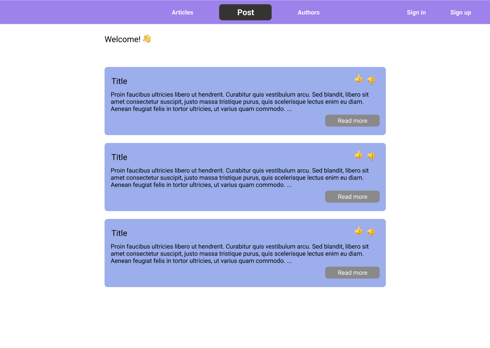
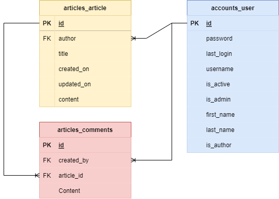

<div id="top"></div>

<div align="center">
 <a href="https://github.com/kylejuliandev/dev_blog_assignment">
    
  </a>
  <h3 align="center">Dev Blog Coursework Submission</h3>
  <p align="center">
    By Kyle Juian
  </p>
</div>

<details>
  <summary>Table of Contents</summary>
  <ol>
    <li><a href="#introduction">About The Project</a></li>
    <li>
      <a href="#getting-started">Getting Started</a>
      <ul>
        <li><a href="#prerequisites">Prerequisites</a></li>
        <li><a href="#installation">Installation</a></li>
        <li><a href="#data">Data</a></li>
      </ul>
    </li>
  </ol>
</details>

___

## Introduction

A Python 3.10 Django web application with backing PostgreSQL database to serve blog articles. This is Kyle Julian's Software Engineering and Agile Winter 2022 Assignment submission.

This project is a proof of concept on how, using Python and Django, a relatively simple blogging website can be engineered. Inspired from:

* [The Netflix Tech Blog](https://netflixtechblog.com/)
* [Meta for Developers](https://developers.facebook.com/blog)
* [Google Blog](https://developers.googleblog.com/)
* [Microsoft Developer Blogs](https://devblogs.microsoft.com/)

## Getting started

### Prerequisities

The project is built using the below technologies. You will need to install them locally before developing the site.

* [Python 3.10](https://www.python.org/downloads/release/python-3100/) 🐍
* [Docker](https://www.docker.com/products/docker-desktop) 🐳
* [VSCode](https://code.visualstudio.com/) 🖊
  * [Python extensions](https://marketplace.visualstudio.com/items?itemName=ms-python.python)
* [PostgreSQL 14.2](https://www.postgresql.org/) 🗃
  * A docker-compose is provided to aid in initialising the database
* [Pgadmin](https://www.pgadmin.org/)

### Installation

1. Clone the repository

    ```ps1
    git clone https://github.com/kylejuliandev/dev_blog_assignment.git
    ```

1. Create a python virtual environment

    1. Open a terminal in the recently cloned repository folder

    1. Execute the following

        ```ps1
        python -m venv env
        ```

    1. Ensure your open terminal is activated for the python virtual environment

        ```ps1
        env\Scripts\Activate.ps1
        ```

1. Install the project dependencies through

    ```ps1
    pip install -r requirements.txt
    ```

1. Set up a PostgreSQL database

    1. You can use the [docker-compose.yaml](data/docker-compose.yaml) to spin up a instance of PostgreSQL and [PgAdmin](https://www.pgadmin.org/)

    1. Open a terminal in this directory

    1. Execute the following

       ```ps1
       docker compose up -d
       ```

    1. Open a browser and navigate to `http://localhost:8080`. You will land on the PgAdmin login page

    1. The [docker-compose.yaml](data/docker-compose.yaml) will have the localhost details for connecting to the database

    1. To access the database in Pgadmin you will need to import the server, follow PgAdmin import guide [here](https://www.pgadmin.org/docs/pgadmin4/latest/import_export_servers.html).

        ```json
        {
          "Servers": {
            "1": {
              "Name": "Localhost",
              "Group": "Server Group 1",
              "Port": 5432,
              "Username": "dev_blog_user",
              "Host": "db",
              "SSLMode": "prefer",
              "MaintenanceDB": "dev_blog"
            }
          }
        }
        ```

        **Note, you must specify the docker-compose name for the service, in this case `db`**

    1. You will need to specify the password manually. You can visit [docker-compose.yaml](data/docker-compose.yaml) for the passwords.

1. Now that the database server is ready, you can use the django migrate functionality to introduce the schemas necessary for the application

    ```ps1
    python manage.py migrate
    ```

1. Run the web server

    ```ps1
    python manage.py runserver
    ```

### Data

Below illustrates the initial database design and concept to fulfil the requirements of this project. The proposal includes two tables, namely: Articles, Users, and Comments. Articles will be home to the the Blog Articles "posts" themselves. Comments will allow authenticated users to add comments, remove, and edit comments on a Blog post.



#### Changing the design

When changing the design you can use these handy django ulities for generating, applying, and rolling back the migrations.

```ps1
python .\manage.py makemigrations
```

```ps1
python manage.py migrate articles 0001
```

```ps1
python .\manage.py migrate articles zero
```

To load test data you can use the `loaddata` command, as shown below

```ps1
python .\manage.py loaddata .\articles\seed\0001_Articles.json
```

### Docker

If you wish to build a Docker image of the dev_blog web application application, you can use the following docker command:

```ps1
docker build -t 'devblog:latest' .
```

To create a container of the newest image, you can do:

```ps1
docker run -e ENVIRONMENT=prod -e DATABASE_URL=<database_url> -e AZURE_CONNECTION_STRING=<azure_connection_string> -e DJANGO_SECRET_KEY=<django_secret_key> -p 8000:8000 devblog
```

#### Postgresql Database Url

Wherein, the Database URL is the locally accessible Postgresql database server. The url must conform to the standard as required by Postgresql. You can read more [here](https://www.postgresql.org/docs/current/libpq-connect.html#LIBPQ-CONNSTRING).

```txt
postgresql://[userspec@][hostspec][/dbname][?paramspec]
```

#### Azure Connection String (CDN assets)

The Azure Connection String will be the location of the Blob store where the CDN assets are stored. When running the site locally this can be the [emulated storage](https://docs.microsoft.com/en-us/azure/storage/common/storage-use-azurite?tabs=visual-studio). The emulated storage connection string will look like the following:

```txt
DefaultEndpointsProtocol=http;AccountName=devstoreaccount1;AccountKey=Eby8vdM02xNOcqFlqUwJPLlmEtlCDXJ1OUzFT50uSRZ6IFsuFq2UVErCz4I6tq/K1SZFPTOtr/KBHBeksoGMGw==;BlobEndpoint=http://127.0.0.1:10000/devstoreaccount1;QueueEndpoint=http://127.0.0.1:10001/devstoreaccount1;
```
